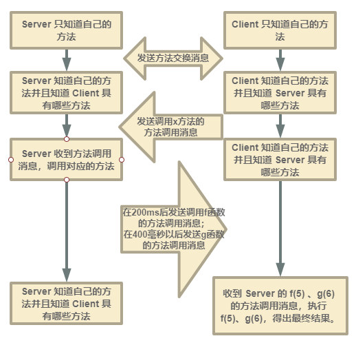

# dnode 解析
# 什么是 dnode
[dnode](https://github.com/substack/dnode) 是一个类似 Node.js 里的 net 的双工流，实现了远程过程调用，也就是说，是一个异步 RPC 的实现。

dnode 既可以运行在 Node.js 中，也可以通过 Browserify 运行在浏览器中，或者是任何支持 Stream 的传输协议中。

看一个简单例子：
```javascript
var dnode = require('dnode');

// server 提供了一个 add 方法
var server = dnode(function (remote, conn) { 
  this.add = function (a, b, cb) { cb(a+b) };
});

server.listen(3000);

// client 可以调用 server 提供的 add 方法
dnode.connect(3000, function (remote, conn) {
  remote.add(33, 44, function (n) {
    console.log('n=' + n); // n=77
    conn.end();
  });
});
```

通过这个简单例子可以看出，通过 dnode ，我们可以在客户端调用服务端的方法。

dnode 是怎么做到这种神奇的效果的呢？这就要从 dnode-protocol 说起了。


# dnode-protocol
[dnode-protocol](https://github.com/substack/dnode-protocol) 是 dnode 的协议层，dnode 基于这个协议层，增加 stream 和 net 的实现。也就是说，dnode 实现 RPC 的部分就是 dnode-protocol。

看这样一个例子：
```javascript
var proto = require('dnode-protocol');

// server 端提供 x 方法和 y 变量
var s = proto({
  x : function (f, g) {
    setTimeout(function () { f(5) }, 200);
    setTimeout(function () { g(6) }, 400);
  },
  y : 555
});

// client 端什么方法都不提供
var c = proto();

// 监听各自的 `request` 事件，在对方的 handle(req) 里处理
s.on('request', c.handle.bind(c)); 
c.on('request', s.handle.bind(s));

// c 监听 remote 事件，该事件在双方互相交换方法以后触发，回调里能获得一个包含对方所有提供的方法的 remote 对象
c.on('remote', function (remote) {
  function f (x) { console.log('f(' + x + ')') }
  function g (x) { console.log('g(' + x + ')') }
  remote.x(f, g);
});

// 开始，发送方法交换消息
s.start();
c.start();

// 结果：
// f(5)
// g(6)
```

protocol 的底层就是一个 EventEmitter。

在 server和 client 都定义好各自具有的方法（这里 client 没有方法）以后，各自监听自己的 `request` 事件，该事件在自己要发送一个 `request` 的时候发生，这时候监听的回调里就能获得这个准备好的 `request`。

因为 `request` 是要发给对方的，这里没有网络，所以直接写的 `s.on('request', c.handle.bind(c))` 的意思就是，s 的 `request` 发送给 c 来处理。

暂时先跳过具体是如何 `handle` 的，继续后面的步骤。

c 监听 `remote` 事件，该事件发生在我收到一个方法交换消息以后，至于什么是方法交换消息后面也会细说，这里事件回调里就能获得一个包含所有发送方可以给我调用的方法的 `remote` 对象，调用对象里的方法就会通过发送消息给对方的方式来调用到对方的方法。

过程图如下：


## dnode-protocol 消息解析
dnode-protocol 的消息格式如下：
* method : String or Integer
* arguments : Array
* callbacks : Object
* links : Array

上述过程中发送的 dnode-protocol 的消息是这样的：

```javascript
 // c 发送的方法交换消息
{
  "method": "methods",
  "arguments": [ {} ],
  "callbacks": {},
  "links": []
}

// s 发送的方法交换消息
{
  "method": "methods",
  "arguments": [ { "x":"[Function]", "y": 555 } ],
  "callbacks": { "0": [ "0", "x" ] },
  "links": []
}

// c 发送的方法调用消息
{
  "method": 0,
  "arguments": [ "[Function]", "[Function]" ],
  "callbacks": { "0": ["0"], "1": ["1"] },
  "links": []
}

// s 执行 x 调用到 f(5) 所发的方法调用消息
{
  "method": 0,
  "arguments": [5],
  "callbacks": {},
  "links": []
}

// s 执行 x 调用到 g(6) 所发的方法调用消息
{
  "method": 1,
  "arguments": [6],
  "callbacks": {},
  "links": []
}

```


